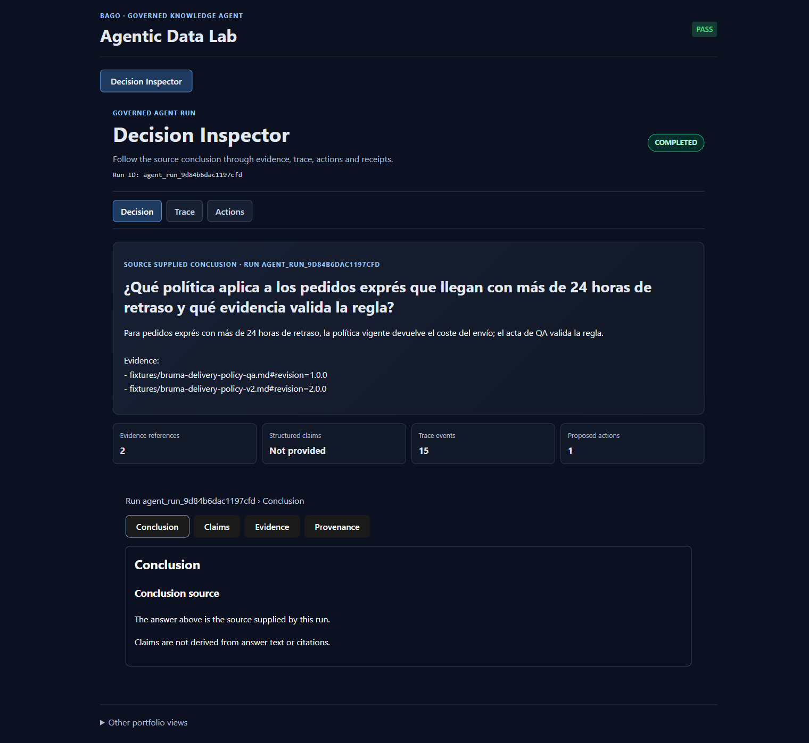
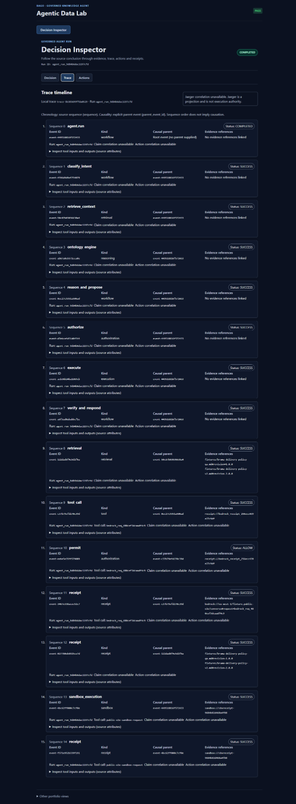
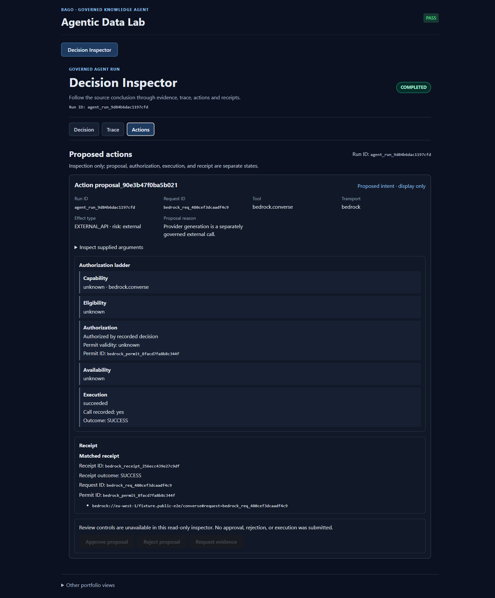
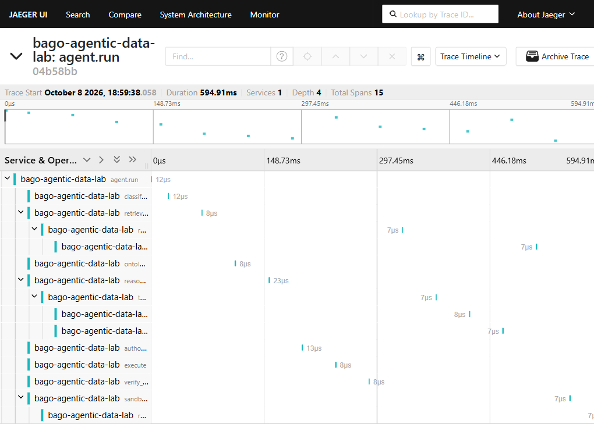

# Manual para dummies: cómo leer una ejecución

**Clase 01 · Marc Valls**

## CLASE 01  ·  CÓMO LEER UNA EJECUCIÓN

| PREGUNTA DE ENTRADA¿Cómo sé qué hizo un agente y qué evidencia respalda su respuesta?Una ruta visual: decisión, traza, acción y recibo. |
| --- |

En esta clase aprenderás a reconocer los identificadores, seguir los eventos y comprobar si una acción tiene un recibo válido.

| DECISION | TRACE | ACTIONS | JAEGER |
| --- | --- | --- | --- |

Repositorio: C:\Users\AMTEC_Terminal_1º\BAGO_AGENTIC_DATA_LAB

Decision Inspector: http://127.0.0.1:8082

Jaeger local: http://localhost:16686

Documentación: docs/decision-inspector dentro del repositorio

### ANTES DE EMPEZAR

| 01  Identifica el Run ID de la ejecución. | 02  Distingue respuesta, evidencia y claims. |
| --- | --- |
| 03  Lee los eventos de Trace en orden. | 04  Comprueba autorización, ejecución y recibo. |

> **Cómo usar este manual.** Lee, observa, practica y verifica antes de avanzar.

> **Aviso.** La interfaz es de solo lectura: no aprueba ni ejecuta acciones.

### LECCIÓN 01  ·  OBSERVAR

## Leer la decisión

Abre http://127.0.0.1:8082. La primera vista resume una ejecución real. Anota el Run ID para saber qué ejecución estás mirando.

Los contadores muestran cuánta evidencia recuperó la ejecución, si hay claims estructurados, cuántos eventos de traza llegaron y cuántas acciones aparecen.



*Vista Decision: resumen de ejecución, evidencias y claims disponibles.*

### Cómo interpretar esta pantalla

•  La respuesta es el texto producido por la ejecución.

•  Una referencia recuperada es un documento consultado; no demuestra por sí sola que apoye una frase concreta.

•  “Structured claims: Not provided” significa que la fuente no separó la respuesta en afirmaciones verificables.

•  Si falta el vínculo claim→evidencia, el Inspector lo deja indicado. No inventa la relación.

### LECCIÓN 02  ·  SEGUIR

## Leer la cronología

Selecciona Trace en la barra superior. Cada tarjeta representa un evento de LocalTrace. El número de secuencia indica el orden. La relación padre solo expresa causalidad cuando la fuente la registró.



*Vista Trace: primeros eventos de la cronología LocalTrace.*

### Tres identificadores

run_id: identifica la ejecución del agente.

LocalTrace trace_id: identifica el registro local de eventos.

Jaeger trace ID: identifica la traza que Jaeger indexó. En esta validación: 04b58bb123bb6cc94a8cc0d60c7145ae.

> **Aviso.** La pantalla dice que no hay correlación directa con Jaeger en este payload. El grafo existe, pero el Inspector no tiene un enlace automático entre ambos IDs.

### LECCIÓN 03  ·  COMPROBAR

## Revisar acciones y recibos

Selecciona Actions. Lee los estados de arriba abajo: capacidad, elegibilidad, autorización, disponibilidad, ejecución y recibo. Cada uno responde a una pregunta distinta.



*Vista Actions: autorización, ejecución y recibos.*

### Regla práctica

•  Una propuesta dice qué se podría hacer. No significa que esté autorizado.

•  Una autorización no demuestra que la acción se ejecutó.

•  Para confirmar ejecución hace falta un recibo asociado a la misma ejecución.

•  Si al recibo le falta run_id o pertenece a otro run, no se acepta como éxito verificado.

> **Ejemplo.** Ejemplo: “SUCCESS” sin un recibo válido se muestra como “unverified”.

### LECCIÓN 04  ·  LOCALIZAR

## Encontrar el grafo en Jaeger

Abre http://localhost:16686. Es otra pantalla: busca y dibuja los spans que recibió el colector local.

Búsqueda directa: pega 04b58bb123bb6cc94a8cc0d60c7145ae en “Lookup by Trace ID”.

Búsqueda por servicio: elige bago-agentic-data-lab, selecciona agent.run y pulsa Find Traces.



*Grafo real de la traza local en Jaeger.*

### Qué demuestra este grafo

•  Jaeger encontró la traza local.

•  Se enviaron 15 spans y Jaeger observó 15.

•  Los nodos son spans; las flechas muestran su relación en la traza.

•  Esto no demuestra envío a AWS ni a un colector remoto.

### LECCIÓN 05  ·  PRACTICAR

## Repetir el recorrido

### La demostración registrada

LocalTrace trace-5b385699ffda0529 se proyectó por OTLP/HTTP a Jaeger. Jaeger encontró la traza 04b58bb123bb6cc94a8cc0d60c7145ae y observó sus 15 spans. El informe está en evidence/l15_otel_jaeger_live.md.

### Repite la lectura

1. Abre el Inspector y anota Run ID.

2. Mira los contadores. Si claims dice “Not provided”, no hay claims estructurados.

3. Abre Trace; anota trace_id y revisa el orden y los avisos.

4. Abre Actions; comprueba el recibo y su run_id.

5. Abre Jaeger y busca el ID de Jaeger del informe. Una ejecución nueva tendrá IDs distintos.

6. Compara las operaciones y los spans encontrados.

> **Clave.** Conclusión correcta: “Jaeger recibió y mostró esta traza local”. No afirmes que el Inspector enlaza automáticamente con Jaeger o que la traza llegó a AWS.

### Si una página no abre

### Decision Inspector

Desde PowerShell, comprueba el servicio:

```powershell
Invoke-RestMethod http://127.0.0.1:8082/api/health
````

La respuesta esperada contiene status “ok”. Si el servicio está detenido y sus dependencias instaladas, desde la raíz del repo:

```powershell
python -m uvicorn src.api.server:app --host 127.0.0.1 --port 8082
````

### Jaeger

Desde la raíz del repo, inicia Jaeger local con Docker Compose:

```powershell
docker compose -p bago-otel -f infra/observability/docker-compose.yml up -d
````

Después abre http://localhost:16686.

## Glosario rápido

Ejecución o run: operación completa del agente, identificada por run_id.

Claim: afirmación concreta que se revisa frente a evidencia.

Evidencia: documento, fragmento o referencia recuperada.

LocalTrace: registro local de eventos; es la fuente de trazabilidad de este proyecto.

Span: una operación individual dibujada como nodo en Jaeger.

OTLP: transporte usado para enviar spans a Jaeger.

Recibo: registro del resultado de una acción.

## Límites conocidos

•  La ejecución actual no tiene claims ni relaciones claim→evidencia estructuradas.

•  La UI no muestra un enlace directo al Jaeger trace ID.

•  La demostración cubre Jaeger local; AWS y colectores remotos quedan fuera de este recorrido.

•  La navegación accesible con lector de pantalla requiere una revisión específica.

### COMPRUEBA LO APRENDIDO

| ☐  Puedo distinguir run_id de Jaeger trace ID.☐  Puedo explicar por qué una cita no demuestra por sí sola una claim.☐  Puedo comprobar que el recibo pertenece al mismo run. |
| --- |

| IDEA FINAL  ·  Identifica la ejecución, sigue su traza y exige un recibo válido antes de dar una acción por confirmada. |
| --- |
