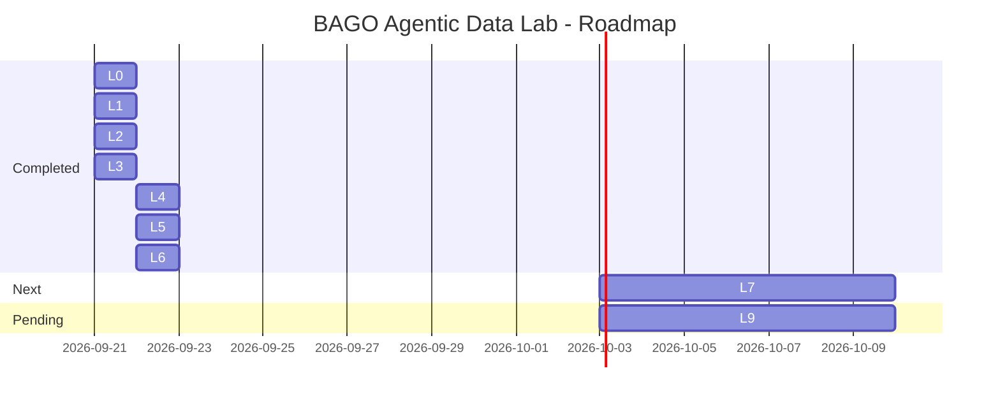

# 🧪 BAGO Agentic Data Lab

[](https://github.com/MarcValls/BAGO_AGENTIC_DATA_LAB)
[](https://github.com/MarcValls/BAGO_AGENTIC_DATA_LAB/tree/main)
[](https://github.com/MarcValls/BAGO_AGENTIC_DATA_LAB/commits/main)
[]()
[]()
[](LICENSE)

> **Laboratorio experimental para desarrollar capacidades de AI Engineering con gobernanza BAGO**
> 
> Última actualización: 2026-09-22

---

## 📊 Estado Actual

| Métrica | Valor |
|---------|-------|
| **Tests Passing** | 74/74 ✅ |
| **Chunks Indexados** | 65 (3 docs) |
| **Fase Actual** | L6 ✅ VERIFIED (offline; AWS live NOT_RUN) |
| **Próxima Fase** | L7 · Bedrock Knowledge Base |

---

## 🗺️ Roadmap



### Fases Detalladas

| Fase | Estado | Descripción | Job Target |
|------|--------|-------------|------------|
| L0 | ✅ | Baseline & Lab Contract | - |
| L1 | ✅ | LangGraph Governed Execution | - |
| L2 | ✅ | ETL Pipeline (idempotencia, receipts) | - |
| L3 | ✅ | Metadata & Ontology (schema, ontology, lineage, evidence) | - |
| L4 | ✅ | Governed RAG (hybrid retrieval + evidence) | **Orbitant** |
| L5 | ✅ | MCP con gobernanza (discovery, registry, permits) | **Orbitant** |
| L6 | ✅ | AWS Bedrock Provider gobernado (offline; live AWS NOT_RUN) | **Tuio** |
| L7 | ⏳ | Bedrock Knowledge Base | **Devoteam** |
| L8 | ⏳ | Metadata Catalog | - |
| L9 | ⏳ | End-to-End Governed Agent | **commercetools** |

---

## 🏗️ Arquitectura

**Principio Fundamental:** LangGraph propone → BAGO autoriza → ExecutionGateway ejecuta → Receipt evidencia

Ninguna capa externa adquiere autoridad implícita para producir efectos materiales.

```
┌──────────────────────────────────────────────┐
│     BAGO GOVERNANCE LAYER                    │
│  AuthorizationBoundary → Permit              │
│  (validación, action limits, human escalation)│
└──────────────────────────────────────────────┘
              ↓
┌──────────────────────────────────────────────┐
│   LANGGRAPH ORCHESTRATION                    │
│  START → classify → retrieve → reason →      │
│  propose → auth_gate → execute → verify → END│
└──────────────────────────────────────────────┘
              ↓
┌──────────────────────────────────────────────┐
│   CAPABILITY ADAPTERS                        │
│  ETL | RAG | MCP | Bedrock | Vector DB | APIs│
└──────────────────────────────────────────────┘
```

---

## 📁 Estructura del Repositorio

```
BAGO_AGENTIC_DATA_LAB/
├── .github/agents/
│   └── bago-sync-agent.agent.md # Agente gobernado de commit/push/merge
├── src/
│   ├── orchestration/
│   │   └── state_graph.py       # L1 ✅ (450 líneas)
│   ├── etl/
│   │   └── pipeline.py          # L2 ✅ (650 líneas)
│   ├── retrieval/               # L4 ✅
│   │   └── governed_rag.py      # Hybrid retrieval + governed evidence
│   ├── metadata/                # L3 ✅
│   │   ├── schema.py            # Entidades y metadata
│   │   ├── ontology.py          # Relaciones y reglas
│   │   └── ontology_generator.py # Propuestas gobernadas L1→L3
│   └── adapters/                # L5-L6 ✅ / L7-L8 ⏳
│       ├── __init__.py
│       ├── mcp_adapter.py       # Discovery → registry → permit → call
│       └── bedrock_provider_adapter.py # Converse + streaming + receipts
├── tests/
│   ├── test_l1_governance.py    # 7 CRIT P0 ✅
│   ├── test_l2_etl_pipeline.py  # 4 CRIT P0 ✅
│   ├── test_l3_ontology.py      # 12 CRIT P0 ✅
│   ├── test_l3_evidence.py      # 2 evidence checks ✅
│   ├── test_metadata_schema.py  # 4 schema checks ✅
│   ├── test_ontology_generator.py # 7 generator checks ✅
│   ├── test_retrieval_accuracy.py # 9 retrieval checks ✅
│   ├── test_retrieval_benchmark.py # 3 benchmark checks ✅
│   ├── test_mcp_governance.py   # 7 MCP governance checks ✅
│   └── test_bedrock_integration.py # 10 Bedrock boundary checks ✅
├── evidence/
│   ├── l3_ontology_graph.md       # Mermaid + integrity receipt
│   ├── ontology_proposal.md       # Propuesta sobre docs BAGO actuales
│   ├── ontology_proposal_examples.md # Propuestas pendientes de aprobación
│   ├── retrieval_benchmark_results.md # Comparativa reproducible L4
│   ├── mcp_governed_demo.md      # Receipt de ronda MCP local
│   ├── mcp_governed_demo.mp4     # Vídeo de evidencia L5
│   ├── mcp_governed_demo.mp4.sha256 # Hash del vídeo
│   └── bedrock_provider_benchmark.md # Benchmark offline L6
├── scripts/
│   ├── generate_l3_ontology_evidence.py
│   ├── generate_ontology_proposal.py
│   ├── benchmark_retrieval.py
│   ├── local_mcp_server.py
│   ├── run_mcp_demo.py
│   ├── render_mcp_evidence_video.py
│   ├── benchmark_bedrock_provider.py
│   └── generate_dynamic_readme.py
├── docs/
│   ├── ontology_generator.md  # L1 → L2 → L3 gobernado
│   ├── governed_rag.md        # L4: retrieval + filtros + citas
│   ├── mcp_governance.md      # L5: capabilities + permits + receipts
│   └── aws_bedrock_setup.md   # L6: IAM + quotas + costes + live checklist
├── l2_etl_metadata.db           # 65 chunks indexados
├── LAB_CONTRACT.md              # Límites con BAGO canónico
├── ARCHITECTURE.md              # Decisiones arquitectónicas
├── ROADMAP.md                   # Timeline detallado
├── LEARNING_LEDGER.md           # Aprendizajes por fase
├── JOB_SKILL_MATRIX.md          # Mapeo a empleabilidad
├── STATE.md                     # Estado operativo
└── README.md                    # Este archivo
```

---

## 🎯 Job Market Alignment

### Target Roles

| Empresa | Rol | Fit Técnico | Gap Principal | Wave |
|---------|-----|-------------|---------------|------|
| **Orbitant** | AI Engineer | 93% | RAG + Cloud | 2-3 semanas |
| **Tuio** | Forward Deployed AI Engineer | 97% | MCP + Bedrock | 4-5 semanas |
| **Devoteam** | GCP AI Engineer (Gemini Enterprise) | 89% | Vertex AI / GCP | 6-7 semanas |
| **commercetools** | AI Engineer | 97% | Portfolio completo | 10 semanas (stretch) |

### Skills Evidenciadas

✅ **Python avanzado** - pytest, dataclasses, type hints  
✅ **Testing CRIT P0** - 74 tests passing, 0 failures
✅ **ETL / Data Pipelines** - 6 stages, idempotencia, receipts  
✅ **Content hashing** - SHA-256 para deduplicación  
✅ **LangGraph StateGraph** - nodes, edges, TypedDict state  
✅ **Gobernanza BAGO** - AuthorizationBoundary → Permit → ExecutionGateway  
✅ **Metadata & Ontology** - schema, generator, lineage, integrity y evidencia Mermaid
✅ **Governed RAG** - BM25-like + semantic hash baseline, hybrid fusion, reranking y filtros
✅ **Governed MCP** - discovery, registry, effect classification, permits y receipts
✅ **AWS Bedrock Provider** - Converse/streaming gobernados, retries, quotas, costes y receipts offline

⏳ **En progreso:**
- Validación live AWS con credenciales/model access (L6)
- Bedrock Knowledge Base (L7)

---

## 🔧 Comandos Útiles

```bash
# Ejecutar todos los tests
python -m pytest tests/ -v

# Ejecutar fase específica
python -m pytest tests/test_l1_governance.py -v
python -m pytest tests/test_l2_etl_pipeline.py -v
python -m pytest tests/test_l3_ontology.py tests/test_l3_evidence.py tests/test_metadata_schema.py -v

# Validar Governed RAG y benchmark reproducible
python -m pytest tests/test_retrieval_accuracy.py tests/test_retrieval_benchmark.py -v
python scripts/benchmark_retrieval.py

# Validar MCP gobernado y generar su evidencia visual
python -m pytest tests/test_mcp_governance.py -v
python scripts/run_mcp_demo.py
python scripts/render_mcp_evidence_video.py

# Validar Bedrock Provider offline y generar benchmark de receipts
python -m pytest tests/test_bedrock_integration.py -v
python scripts/benchmark_bedrock_provider.py

# Regenerar evidencia visual de L3
python scripts/generate_l3_ontology_evidence.py

# Proponer ontología desde documentación (no persiste relaciones)
python scripts/generate_ontology_proposal.py

# Ver estadísticas ETL
python -c "from src.etl.pipeline import ETLPipeline; p=ETLPipeline(); print(f'DB: {p.db_path}')"

# Regenerar este README dinámico
python scripts/generate_dynamic_readme.py

# Planificar sincronización sin mutar Git
python scripts/bago_sync_agent.py plan --fetch --json
```

---

## 📜 Licencia

MIT License - Ver [LICENSE](LICENSE) para detalles.

---

**Nota:** Este README se genera dinámicamente. Para actualizar métricas ejecutar `python scripts/generate_dynamic_readme.py`

Generado: 2026-09-22 01:58:46
