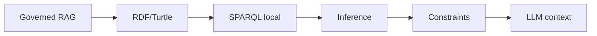

# 🧪 BAGO Agentic Data Lab

[](https://github.com/MarcValls/BAGO_AGENTIC_DATA_LAB/actions/workflows/readme-consistency.yml)
[](https://github.com/MarcValls/BAGO_AGENTIC_DATA_LAB/tree/main)
[](https://github.com/MarcValls/BAGO_AGENTIC_DATA_LAB/actions)
[](LICENSE)

> Laboratorio experimental para desarrollar capacidades de AI Engineering con gobernanza BAGO.
> Este documento se genera desde el estado y los artefactos del repositorio.

## Estado actual

| Métrica | Valor |
|---|---|
| Tests ejecutados | **115/115** |
| Rama pública | `main` |
| Fase actual | **L10 · Governed Ontology Engine** · VERIFIED |
| Siguiente bloque | OpenMetadata local real validation, then local observability/evals |
| Estado declarado | VERIFIED for the local RDF/Turtle materialization, bounded SPARQL subset, deterministic inference, contradiction constraints, RAG seed handoff and injected LLM context; AWS/OpenMetadata/commercetools live integrations remain `NOT_RUN`; GitHub issue #14 is separately executed and verified under human authorization. |

El estado público se limita a lo que existe en el checkout y a la evidencia
referenciada. AWS live, OpenMetadata live y otras integraciones externas
no se presentan como verificadas si STATE.md las marca como NOT_RUN.
El commit, push y merge de este snapshot son operaciones separadas.

## Roadmap detectado

```mermaid
flowchart LR
    L0[L0 Baseline & Lab Contract (COMPLETE)]
    L1[L1 LangGraph Governed Execution (VALIDATED)]
    L2[L2 ETL / Data Pipeline (VALIDATED)]
    L3[L3 Metadata & Ontology (VERIFIED)]
    L4[L4 Governed RAG (VERIFIED)]
    L5[L5 MCP con gobernanza (VERIFIED)]
    L6[L6 AWS Bedrock Provider (VERIFIED (offline))]
    L7[L7 Bedrock Knowledge Base (VERIFIED (offline))]
    L8[L8 Metadata Catalog (VERIFIED (offline))]
    L9[L9 End-to-End Governed Agent (VERIFIED (offline))]
    L10[L10 Governed Ontology Engine (VERIFIED)]
    L0 --> L1
    L1 --> L2
    L2 --> L3
    L3 --> L4
    L4 --> L5
    L5 --> L6
    L6 --> L7
    L7 --> L8
    L8 --> L9
    L9 --> L10
```

| Fase | Estado | Descripción | Tests | Evidencia/docs |
|---|---|---|---:|---:|
| L0 | COMPLETE | Baseline & Lab Contract | 0 | 6 |
| L1 | VALIDATED | LangGraph Governed Execution | 1 | 0 |
| L2 | VALIDATED | ETL / Data Pipeline | 1 | 1 |
| L3 | VERIFIED | Metadata & Ontology | 4 | 2 |
| L4 | VERIFIED | Governed RAG | 2 | 2 |
| L5 | VERIFIED | MCP con gobernanza | 1 | 3 |
| L6 | VERIFIED (offline) | AWS Bedrock Provider | 1 | 2 |
| L7 | VERIFIED (offline) | Bedrock Knowledge Base | 1 | 2 |
| L8 | VERIFIED (offline) | Metadata Catalog | 1 | 2 |
| L9 | VERIFIED (offline) | End-to-End Governed Agent | 1 | 3 |
| L10 | VERIFIED | Governed Ontology Engine | 1 | 3 |

## Arquitectura actual

**Principio:** LangGraph propone → BAGO autoriza → ExecutionGateway ejecuta → Receipt evidencia.



Pipeline actual:

1. RAG recupera documentos y citas
2. Ontology Engine materializa RDF/Turtle
3. SPARQL local consulta relaciones
4. Inference añade inversas, transitivas y simétricas
5. Constraints detecta endpoints, evidencia y contradicciones
6. El LLM recibe caminos y evidencia; no recibe autoridad implícita

## Job market alignment

La tabla se extrae de LAB_CONTRACT.md; no se duplica manualmente aquí.

| Empresa | Rol | Fit | Gap principal | Timeline |
|---|---|---:|---|---|
| Tuio | Forward Deployed AI Engineer | ~96% | Seniority (~5 años) | 4-5 semanas |
| Orbitant | AI Engineer | ~91% | LangGraph + Cloud | 2-3 semanas |
| Devoteam | GCP AI Engineer (Gemini) | ~87% → 93% | Vertex AI / GCP | 6-7 semanas |
| commercetools | AI Engineer | ~97% | Seniority + LLM production | Stretch goal |

## Skills evidenciadas

La tabla se extrae de JOB_SKILL_MATRIX.md y se mantiene fuera del README.

| Skill | Demanda | Nivel actual | Primera evidencia | Entrevista |
|---|---|---|---|---|
| Python | Alta | ✅ Senior | BAGO backend | ✅ Sí |
| REST APIs | Alta | ✅ Senior | BAGO FastAPI | ✅ Sí |
| LangGraph | Muy Alta | ❌ None | L1 state graph | L1 completado |
| LangChain concepts | Alta | ❌ None | — | L1 completado |
| Multi-agent systems | Muy Alta | 🟢 Reinforced | GovernedKnowledgeAgent + L9 evidence | L9 offline |
| Tool use | Muy Alta | ✅ Implementado | BAGO tools + MCP receipts | L5 baseline |
| MCP | Muy Alta | ✅ Baseline gobernado | L5 MCP adapter + video | L5 baseline |
| RAG | Muy Alta | 🟡 Basic | L4 governed RAG | L4 completado |
| Hybrid retrieval | Alta | ❌ None | L4 benchmarks | L4 completado |
| Embeddings | Alta | 🟡 Conceptual | L4 vector store | L4 completado |
| Vector DB | Alta | ❌ None | L4 FAISS/Pinecone | L4 completado |
| ETL | Alta | ❌ None | L2 pipeline | L2 completado |
| Data pipelines | Alta | ❌ None | L2 end-to-end | L2 completado |
| Metadata/Ontology | Media | 🟢 Implementado | L3 schema + L10 engine | L10 local |
| RDF / SPARQL / Knowledge Graphs | Alta | 🟢 Baseline local | L10 RDF/Turtle + SPARQL + inference | L10 local; triplestore live separado |
| Lineage | Media | 🟢 Implementado | L3 relations + L10 paths | L10 local |
| AWS | Alta | 🟡 Adapter offline | L6 adapter + setup doc | Live account validation |
| Bedrock | Alta | 🟡 Provider baseline | L6 Converse/Stream + receipts | Live model evaluation |
| Bedrock Knowledge Bases | Alta | 🟡 Baseline offline | L7 Retrieve/Generate + citations | Live KB evaluation |
| OpenMetadata Catalog | Media | 🟡 Baseline offline | L8 adapter + lineage evidence | Live Docker evaluation |
| IAM | Alta | 🟡 Basic | L6 least-privilege setup | Live policy check |
| CI/CD | Alta | 🟡 Basic | GitHub Actions | L1 completado |
| Evaluation | Muy Alta | 🟢 Framework baseline | 115 tests + README/L9/L10 scenarios | L10 offline |
| Observability | Alta | 🟢 Reinforced | Receipts + evidence links + ontology receipt | L10 offline |
| Secure execution | Muy Alta | ✅ Diseñado | BAGO auth boundary | L1 completado |
| Authorization | Muy Alta | ✅ Diseñado | BAGO permits | L1 completado |
| Auditability | Alta | ✅ Diseñado | BAGO receipts | L1 completado |
| Docker/K8s | Media | ❌ None | Docker Compose | L2/L7 |

## Inventario real del checkout

### Código fuente

- `src/adapters/__init__.py`
- `src/adapters/bedrock_kb_adapter.py`
- `src/adapters/bedrock_provider_adapter.py`
- `src/adapters/mcp_adapter.py`
- `src/adapters/openmetadata_adapter.py`
- `src/agent/__init__.py`
- `src/agent/governed_knowledge_agent.py`
- `src/context/__init__.py`
- `src/context/workspace_binding.py`
- `src/etl/pipeline.py`
- `src/metadata/ontology.py`
- `src/metadata/ontology_engine.py`
- `src/metadata/ontology_generator.py`
- `src/metadata/schema.py`
- `src/orchestration/state_graph.py`
- `src/retrieval/__init__.py`
- `src/retrieval/governed_rag.py`

### Tests

- `tests/test_bago_sync_agent.py` (8 checks)
- `tests/test_bedrock_integration.py` (10 checks)
- `tests/test_bedrock_kb_adapter.py` (10 checks)
- `tests/test_dynamic_readme.py` (3 checks)
- `tests/test_l10_ontology_engine.py` (4 checks)
- `tests/test_l1_governance.py` (7 checks)
- `tests/test_l2_etl_pipeline.py` (4 checks)
- `tests/test_l3_evidence.py` (2 checks)
- `tests/test_l3_ontology.py` (12 checks)
- `tests/test_l9_end_to_end_agent.py` (7 checks)
- `tests/test_mcp_governance.py` (7 checks)
- `tests/test_metadata_schema.py` (4 checks)
- `tests/test_ontology_generator.py` (7 checks)
- `tests/test_openmetadata_adapter.py` (12 checks)
- `tests/test_retrieval_accuracy.py` (9 checks)
- `tests/test_retrieval_benchmark.py` (3 checks)
- `tests/test_workspace_binding.py` (6 checks)

### Evidencia

- `evidence/bago_etl_vs_bedrock_kb_comparison.md`
- `evidence/bedrock_provider_benchmark.md`
- `evidence/l10_ontology_engine.md`
- `evidence/l3_ontology_graph.md`
- `evidence/l8_openmetadata_catalog.md`
- `evidence/l9_authorized_actions_20260922.md`
- `evidence/l9_commercetools_agent.md`
- `evidence/mcp_governed_demo.md`
- `evidence/mcp_governed_demo.mp4`
- `evidence/mcp_governed_demo.mp4.sha256`
- `evidence/ontology_proposal.md`
- `evidence/ontology_proposal_examples.md`
- `evidence/retrieval_benchmark_results.md`

### Documentación

- `docs/aws_bedrock_setup.md`
- `docs/bago-sync-agent.md`
- `docs/bedrock_knowledge_base.md`
- `docs/commercetools_capstone.md`
- `docs/governed_rag.md`
- `docs/mcp_governance.md`
- `docs/ontology_engine.md`
- `docs/ontology_generator.md`
- `docs/openmetadata_catalog.md`
- `docs/readme_generation.md`
- `docs/workspace_binding.md`

### Scripts

- `scripts/bago_sync_agent.py`
- `scripts/benchmark_bedrock_provider.py`
- `scripts/benchmark_retrieval.py`
- `scripts/compare_bago_etl_vs_bedrock_kb.py`
- `scripts/generate_dynamic_readme.py`
- `scripts/generate_l10_ontology_evidence.py`
- `scripts/generate_l3_ontology_evidence.py`
- `scripts/generate_l8_catalog_evidence.py`
- `scripts/generate_l9_agent_evidence.py`
- `scripts/generate_ontology_proposal.py`
- `scripts/local_mcp_server.py`
- `scripts/render_mcp_evidence_video.py`
- `scripts/run_mcp_demo.py`

## Comandos reproducibles

```bash
python -m pytest tests -q
python scripts/generate_dynamic_readme.py
python scripts/generate_dynamic_readme.py --check --skip-tests
```

Tests por fase:

- `L1`: `python -m pytest tests/test_l1_governance.py -q`
- `L2`: `python -m pytest tests/test_l2_etl_pipeline.py -q`
- `L3`: `python -m pytest tests/test_l3_evidence.py tests/test_l3_ontology.py tests/test_metadata_schema.py tests/test_ontology_generator.py -q`
- `L4`: `python -m pytest tests/test_retrieval_accuracy.py tests/test_retrieval_benchmark.py -q`
- `L5`: `python -m pytest tests/test_mcp_governance.py -q`
- `L6`: `python -m pytest tests/test_bedrock_integration.py -q`
- `L7`: `python -m pytest tests/test_bedrock_kb_adapter.py -q`
- `L8`: `python -m pytest tests/test_openmetadata_adapter.py -q`
- `L9`: `python -m pytest tests/test_l9_end_to_end_agent.py -q`
- `L10`: `python -m pytest tests/test_l10_ontology_engine.py -q`

## Contrato de generación

README.md es un artefacto generado. No editarlo manualmente.
Las decisiones estables viven en docs/readme_manifest.json y en los
documentos canónicos enlazados arriba; los inventarios, métricas,
estado Git y resultados de tests se calculan al generar.

- Generar: python scripts/generate_dynamic_readme.py
- Comprobar deriva: python scripts/generate_dynamic_readme.py --check --skip-tests
- Comprobar con la suite completa: python scripts/generate_dynamic_readme.py --check

Fuente de estado: `STATE.md`; contrato: `LAB_CONTRACT.md`;
skills: `JOB_SKILL_MATRIX.md`; manifiesto: `docs/readme_manifest.json`.

MIT License — ver [LICENSE](LICENSE).
