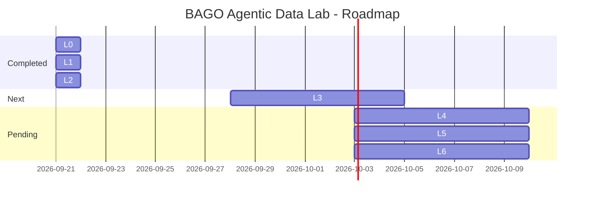

# 🧪 BAGO Agentic Data Lab

> Laboratorio experimental para desarrollar capacidades de AI Engineering con gobernanza BAGO

---

## 📊 Estado Actual

| Métrica | Valor |
|---------|-------|
| Tests Passing | 11/11 ✅ |
| Chunks Indexados | 65 (3 docs) |
| Fase Actual | L2 ✅ COMPLETE |

---

## 🗺️ Roadmap

---

## 🎯 Job Market Alignment

| Empresa | Rol | Fit | Gap |
|---------|-----|-----|-----|
| Orbitant | AI Engineer | 93% | RAG |
| Tuio | Forward Deployed AI | 97% | MCP + Bedrock |
| Devoteam | GCP AI Engineer | 89% | Vertex AI |

---

✅ Skills evidenciadas: Python, pytest, ETL, LangGraph, Gobernanza BAGO

⏳ En progreso: Metadata, RAG, MCP, Bedrock
