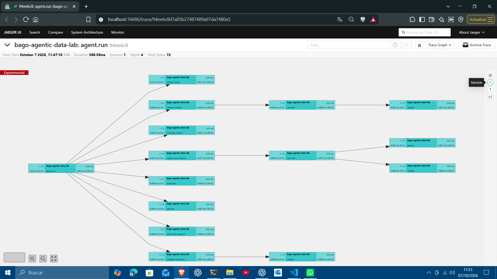

# 🧪 BAGO Agentic Data Lab

[](https://github.com/MarcValls/BAGO_AGENTIC_DATA_LAB/actions/workflows/ci.yml)
[](https://github.com/MarcValls/BAGO_AGENTIC_DATA_LAB/actions/workflows/readme-consistency.yml)
[](https://github.com/MarcValls/BAGO_AGENTIC_DATA_LAB/tree/main)
[](https://github.com/MarcValls/BAGO_AGENTIC_DATA_LAB/actions)
[](LICENSE)

> Laboratorio experimental para desarrollar capacidades de AI Engineering con gobernanza BAGO.
> Este documento se genera desde el estado y los artefactos del repositorio.

## El problema

Un agente empresarial necesita demostrar de dónde viene la respuesta, qué la autoriza y qué efecto ocurrió. Una salida plausible del modelo no demuestra ninguno de esos hechos.

## Arquitectura en una mirada

```text
CONOCIMIENTO → EVIDENCIA → RELACIONES → PROPUESTA → AUTORIZACIÓN → EJECUCIÓN RESTRINGIDA → RECIBO → TRACE → EVALUACIÓN
```

El modelo propone; BAGO controla si la propuesta cruza a un efecto. La ruta local reproducible registra 15 spans y conserva los límites entre propuesta, permiso y ejecución.

## Ejecuta la demo

La extracción de producto reutiliza los componentes L0–L15 existentes; no
introduce una arquitectura de agente paralela. Ver [portfolio/README.md](portfolio/README.md).

```bash
python demo.py
```

El comando materializa summary, agent run, receipts, trace y evaluation en
`demo_output/latest/` sin convertir esa proyección en fuente canónica.

## Evidencia de ejecución

La evidencia versionada de L15 registra el trace consultado en Jaeger: [resultado y trace ID](evidence/l15_otel_jaeger_live.md). El demo produce `trace.json`, recibos y evaluación determinista; Jaeger es una proyección local, no autoridad de ejecución.

### See it in action

Vista real del trace L15 en Jaeger: 15 spans conectan retrieval, propuesta, permiso, ejecución y recibos.



Trace ID: `04b58bb123bb6cc94a8cc0d60c7145ae` · 15 spans · validado localmente el 2026-10-08. La [evidencia L15 versionada](evidence/l15_otel_jaeger_live.md) es accesible desde GitHub; la UI de Jaeger solo está disponible al reproducirla en local.

### Reproduce el trace en local

Requiere Docker. Este recorrido inicia Jaeger, exporta y consulta el trace, y detiene el servicio al terminar:

```bash
docker compose -p bago-otel -f infra/observability/docker-compose.yml up -d
python scripts/run_l15_otel_live_validation.py --check
docker compose -p bago-otel -f infra/observability/docker-compose.yml down
```

Guía detallada: [L15 OpenTelemetry + Jaeger](docs/otel_jaeger.md).

## Monitor local del equipo Codex

Para observar en vivo las tareas y eventos que registra la coordinación local, instala las dependencias backend con `python -m pip install -r requirements.txt fastapi uvicorn`, y ejecuta la API y el frontend en dos terminales:

```bash
python -m src.api.server
```

En otra terminal, entra en `frontend`, ejecuta `npm install` y después `npm run dev`. Abre [http://localhost:5173/team-monitor.html](http://localhost:5173/team-monitor.html). La página consulta `/api/team/status` cada cuatro segundos; el estado mostrado procede de `.codex-team/state.json` y `.codex-team/events.jsonl`. Solo refleja eventos registrados por teamctl, no toda la actividad interna de la extensión Codex.

Profundiza en las fases L0-L15 en el [roadmap](#roadmap-detectado), o consulta [STATE.md](STATE.md) para el alcance canónico y [portfolio/README.md](portfolio/README.md) para la presentación del producto.

## Estado actual

| Métrica | Valor |
|---|---|
| Tests ejecutados | **207/207** |
| Rama pública | `main` |
| Estado actualizado | 2026-10-10 |
| Fase actual | **L15 · OpenTelemetry + Jaeger Local Live** · VERIFIED (local live) |
| Siguiente bloque | do not make additional cloud calls under the zero-cost rule; confirm a later billing record manually only if zero-dollar charging must be claimed, and keep streaming, Knowledge Base and remote integrations separately scoped |
| Estado declarado | VERIFIED for the local RDF/Turtle materialization, bounded SPARQL subset, deterministic inference, contradiction constraints, RAG seed handoff, the real local OpenMetadata 1.12.6 validation, the local restricted sandbox execution boundary, the local trace/evaluation chain, the public zero-cost E2E demo executed by the same CI contract, the persistent local SQLite vector index consumed by GovernedRAG and the local OpenTelemetry → Jaeger trace projection; one bounded live AWS Bedrock `Converse` call through the governed adapter is `VERIFIED`; a separate read-only AWS Free Tier check observes an active `FREE` account plan with USD 100.00 remaining at validation time; AWS `ConverseStream`, Bedrock Knowledge Base, remote OpenMetadata, commercetools live integrations remain `NOT_RUN`, while zero-dollar billing for the Bedrock call remains `NOT_PROVEN`; GitHub issue #14 is separately executed and verified under human authorization, and the local human-reviewed checkpoint is recorded in `evidence/bago_canon_compliance_review.md`. |

El estado público se limita a lo que existe en el checkout y a la evidencia
referenciada. Cada superficie AWS, OpenMetadata u otra integración externa
conserva en STATE.md su alcance exacto: VERIFIED, NOT_RUN o NOT_PROVEN.
El commit, push y merge de este snapshot son operaciones separadas.

## Fuentes canónicas

El README proyecta estos documentos; no los sustituye ni los edita.

| Documento | Función | Estado |
|---|---|---|
| `STATE.md` | estado operativo actual | PRESENTE |
| `LAB_CONTRACT.md` | contrato del laboratorio | PRESENTE |
| `ARCHITECTURE.md` | arquitectura y límites | PRESENTE |
| `ROADMAP.md` | roadmap ejecutable | PRESENTE |
| `LEARNING_LEDGER.md` | aprendizaje y evidencia | PRESENTE |
| `JOB_SKILL_MATRIX.md` | skills y alineación laboral | PRESENTE |

## Agente de sincronización

La sincronización operativa está separada del catálogo de copias de referencia.

| Componente | Estado | Función |
|---|---|---|
| `.github/agents/bago-sync-agent.agent.md` | PRESENTE | Definición del agente: contrato operativo |
| `scripts/bago_sync_agent.py` | PRESENTE | Ejecutor gobernado: commit, push, PR y merge con receipts |
| `docs/bago-sync-agent.md` | PRESENTE | Documentación: uso y límites |

## Catálogo de agentes

El catálogo organizado por responsabilidad se genera desde `agents/CATALOG_MANIFEST.json`.

Alcance: `reference-only` · activación: `none`.
El catálogo es de referencia; la definición operativa sigue en `.github/agents`.

| Grupo | Archivos | Responsabilidad |
|---|---:|---|
| `01-gobierno-orquestacion` | 11 | arranque, contexto, coordinación y entrega |
| `02-exploracion-arquitectura` | 13 | exploración, arquitectura, modularidad y archivo |
| `03-backend-contratos` | 4 | backend y contratos frontend-backend |
| `04-frontend-ui` | 10 | frontend, UI, estado y navegación |
| `05-seguridad-verdad` | 8 | seguridad, sinceridad, comandos y aislamiento |
| `06-tests-calidad-release` | 20 | tests, higiene, análisis, verificación y release |
| `07-sincronizacion` | 6 | Git, documentación y sincronización de runtime |
| `08-runtime-supervision` | 3 | infraestructura de agentes |
| `09-activadores-no-agentes` | 11 | skills y paquetes de activación, no agentes |

## Roadmap detectado


```mermaid
flowchart LR
    L0["L0 Baseline & Lab Contract (COMPLETE)"]
    L1["L1 LangGraph Governed Execution (PARTIAL (local evidence))"]
    L2["L2 ETL / Data Pipeline (VALIDATED)"]
    L3["L3 Metadata & Ontology (VERIFIED)"]
    L4["L4 Governed RAG (VERIFIED)"]
    L5["L5 MCP con gobernanza (VERIFIED)"]
    L6["L6 AWS Bedrock Provider (VERIFIED (live Converse + Free Plan observed))"]
    L7["L7 Bedrock Knowledge Base (VERIFIED (offline))"]
    L8["L8 Metadata Catalog (VERIFIED (local live))"]
    L9["L9 End-to-End Governed Agent (VERIFIED (offline))"]
    L10["L10 Governed Ontology Engine (VERIFIED (local))"]
    L11["L11 Governed Sandbox Layer (VERIFIED (local))"]
    L12["L12 Local Observability & Evals (VERIFIED (local))"]
    L13["L13 Public E2E Demo & CI (VERIFIED (local))"]
    L14["L14 Governed Local Vector Store (VERIFIED (local))"]
    L15["L15 OpenTelemetry + Jaeger Local Live (VERIFIED (local live))"]
    L0 --> L1
    L1 --> L2
    L2 --> L3
    L3 --> L4
    L4 --> L5
    L5 --> L6
    L6 --> L7
    L7 --> L8
    L8 --> L9
    L9 --> L10
    L10 --> L11
    L11 --> L12
    L12 --> L13
    L13 --> L14
    L14 --> L15
```

| Fase | Estado | Objetivo | Descripción | Tests | Evidencia/docs |
|---|---|---|---|---:|---:|
| L0 | COMPLETE | — | Baseline & Lab Contract | 0 | 6 |
| L1 | PARTIAL (local evidence) | — | LangGraph Governed Execution | 8 | 1 |
| L2 | VALIDATED | — | ETL / Data Pipeline | 4 | 1 |
| L3 | VERIFIED | — | Metadata & Ontology | 25 | 2 |
| L4 | VERIFIED | Orbitant | Governed RAG | 12 | 2 |
| L5 | VERIFIED | Orbitant | MCP con gobernanza | 7 | 3 |
| L6 | VERIFIED (live Converse + Free Plan observed) | Tuio | AWS Bedrock Provider | 10 | 4 |
| L7 | VERIFIED (offline) | Devoteam | Bedrock Knowledge Base | 10 | 2 |
| L8 | VERIFIED (local live) | Devoteam | Metadata Catalog | 22 | 3 |
| L9 | VERIFIED (offline) | commercetools | End-to-End Governed Agent | 7 | 3 |
| L10 | VERIFIED (local) | BAGO / portfolio | Governed Ontology Engine | 4 | 2 |
| L11 | VERIFIED (local) | BAGO / secure execution | Governed Sandbox Layer | 14 | 3 |
| L12 | VERIFIED (local) | BAGO / portfolio | Local Observability & Evals | 5 | 3 |
| L13 | VERIFIED (local) | BAGO / portfolio | Public E2E Demo & CI | 5 | 2 |
| L14 | VERIFIED (local) | BAGO / portfolio | Governed Local Vector Store | 4 | 2 |
| L15 | VERIFIED (local live) | BAGO / portfolio | OpenTelemetry + Jaeger Local Live | 4 | 2 |

## Arquitectura actual

**Principio:** LangGraph propone → BAGO autoriza → ExecutionGateway → SandboxManager → Receipt → LocalTrace → Eval.


```mermaid
flowchart LR
    RAG["Governed RAG"]
    RDF["RDF/Turtle"]
    SPARQL["SPARQL local"]
    INFERENCE["Inference"]
    CONSTRAINTS["Constraints"]
    LLM["LLM context"]
    GATEWAY["ExecutionGateway"]
    SANDBOX["SandboxManager"]
    RECEIPT["Receipt"]
    RAG --> RDF
    RDF --> SPARQL
    SPARQL --> INFERENCE
    INFERENCE --> CONSTRAINTS
    CONSTRAINTS --> LLM
    LLM --> GATEWAY
    GATEWAY --> SANDBOX
    SANDBOX --> RECEIPT
```

Pipeline actual:

1. RAG recupera documentos y citas
2. Ontology Engine materializa RDF/Turtle
3. SPARQL local consulta relaciones
4. Inference añade inversas, transitivas y simétricas
5. Constraints detecta endpoints, evidencia y contradicciones
6. El LLM recibe caminos y evidencia; no recibe autoridad implícita
7. ExecutionGateway exige una SandboxRequest tipada
8. SandboxManager materializa filesystem y proceso acotados
9. Receipt evidencia el resultado o la denegación
10. LocalTrace enlaza workflow, retrieval, permits, sandbox y receipts
11. Local evaluator comprueba cobertura y ausencia de efectos no autorizados
12. Public E2E compone las fronteras locales con fixtures deterministas
13. SQLiteVectorStore persiste vectores deterministas y conserva el gate de metadata
14. GovernedRAG puede consumir el backend semántico persistente y recargar su fingerprint
15. OpenTelemetry proyecta LocalTrace a Jaeger local sin conceder autoridad
16. GitHub Actions repite tests, README, demo, vector validation, Jaeger validation y compile checks

## Job market alignment

La tabla se extrae de LAB_CONTRACT.md; no se duplica manualmente aquí.

| Empresa | Rol | Fit | Gap principal | Timeline |
|---|---|---:|---|---|
| Tuio | Forward Deployed AI Engineer | ~96% | Seniority (~5 años) | 4-5 semanas |
| Orbitant | AI Engineer | ~91% | LangGraph + Cloud | 2-3 semanas |
| Devoteam | GCP AI Engineer (Gemini) | ~87% → 93% | Vertex AI / GCP | 6-7 semanas |
| commercetools | AI Engineer | ~97% | Seniority + LLM production | Stretch goal |

## Skills evidenciadas

La tabla se extrae de JOB_SKILL_MATRIX.md y se mantiene fuera del README.

| Skill | Demanda | Nivel actual | Nivel objetivo | Primera evidencia | Entrevista |
|---|---|---|---|---|---|
| Python | Alta | ✅ Senior | ✅ Senior | BAGO backend | ✅ Sí |
| REST APIs | Alta | ✅ Senior | ✅ Senior | BAGO FastAPI | ✅ Sí |
| LangGraph | Muy Alta | ❌ None | 🎯 Proficient | L1 StateGraph: denegación material; ExecutionGateway aún no integrado | L1 evidencia parcial |
| LangChain concepts | Alta | ❌ None | 🟡 Basic | — | L1 StateGraph, evidencia parcial |
| Multi-agent systems | Muy Alta | 🟢 Reinforced | 🎯 Proficient | GovernedKnowledgeAgent + L9 evidence | L9 offline |
| Tool use | Muy Alta | ✅ Implementado | 🎯 Proficient | BAGO tools + MCP receipts | L5 baseline |
| MCP | Muy Alta | ✅ Baseline gobernado | 🎯 Proficient | L5 MCP adapter + video | L5 baseline |
| RAG | Muy Alta | 🟡 Basic | 🎯 Advanced | L4 governed RAG | L4 completado |
| Hybrid retrieval | Alta | ❌ None | 🎯 Proficient | L4 benchmarks | L4 completado |
| Embeddings | Alta | 🟢 Deterministic local | 🎯 Implementado | HashEmbedding + SQLiteVectorStore | L14 local |
| Vector DB | Alta | 🟢 Local persistent | 🎯 Proficient | SQLiteVectorStore + GovernedRAG reload | L14 local; distributed service separate |
| ETL | Alta | ❌ None | 🎯 Proficient | L2 pipeline | L2 completado |
| Data pipelines | Alta | ❌ None | 🎯 Implementado | L2 end-to-end | L2 completado |
| Metadata/Ontology | Media | 🟢 Implementado | 🎯 Proficient | L3 schema + L10 engine | L10 local |
| RDF / SPARQL / Knowledge Graphs | Alta | 🟢 Baseline local | 🎯 Proficient | L10 RDF/Turtle + SPARQL + inference | L10 local; triplestore live separado |
| Lineage | Media | 🟢 Implementado | 🎯 Proficient | L3 relations + L10 paths | L10 local |
| AWS | Alta | 🟢 Bedrock live + Free Plan observado | 🎯 Bedrock fluent | L6 adapter + live Converse + Free Tier receipts | IAM least-privilege + cargo cero posterior |
| Bedrock | Alta | 🟢 Converse live acotado | 🎯 Proficient | L6 Converse/Stream + live receipt | Stream + model evaluation |
| Bedrock Knowledge Bases | Alta | 🟡 Baseline offline | 🎯 Proficient | L7 Retrieve/Generate + citations | Live KB evaluation |
| OpenMetadata Catalog | Media | 🟢 Local live verificado | 🎯 Proficient | L8 adapter + Docker local + lineage/quality receipts | OpenMetadata remoto |
| IAM | Alta | 🟡 Basic | 🎯 Configurable | L6 least-privilege setup | Live policy check |
| CI/CD | Alta | 🟢 Reproducible | 🎯 Implementado | GitHub Actions + pinned requirements + public E2E | L13 CI |
| Evaluation | Muy Alta | 🟢 Local governance evals | 🎯 Framework | 203 test cases + trace/evidence linkage + L8/L9/L10/L11/L12/L13/L14/L15 scenarios | L15 local + CI |
| Observability | Alta | 🟢 OpenTelemetry local live | 🎯 Completo | LocalTrace + OTLP/HTTP + Jaeger Docker + parent-linked spans | L15 local; remoto separado |
| Secure execution | Muy Alta | 🟢 Local backend verified | 🎯 Implementado | BAGO auth boundary + LocalRestrictedBackend + escape tests | L11 local |
| Authorization | Muy Alta | ✅ Diseñado | 🎯 Implementado | L1 fail-closed gate; MCP, Bedrock y sandbox tienen límites probados por separado | L1 evidencia parcial |
| Auditability | Alta | ✅ Diseñado | 🎯 Implementado | Recibos de adapters/sandbox; L1 no fabrica recibos si no hay gateway | L1 evidencia parcial |
| Docker/K8s | Media | 🟡 Docker Compose local | 🎯 Basic | OpenMetadata Compose + reproducible healthcheck | L8 local |

## Skills estratégicas

La tabla se extrae de JOB_SKILL_MATRIX.md y se mantiene fuera del README.

| Skill | Nivel actual | Nivel objetivo | Evidencia |
|---|---|---|---|
| Arquitectura de sistemas | ✅ Fuerte | ✅ Mantener | AGENTS.md, CANON_BAGO |
| Diseño de contratos | ✅ Fuerte | ✅ Mantener | BAGO contracts |
| Documentación técnica | ✅ Fuerte | ✅ Mantener | Este repo |
| Análisis de trade-offs | ✅ Fuerte | ✅ Mantener | Decision records |
| Comunicación escrita | ✅ Fuerte | ✅ Mantener | Docs claras |

## Inventario real del checkout

### Código fuente

- `src/adapters/__init__.py`
- `src/adapters/bedrock_kb_adapter.py`
- `src/adapters/bedrock_provider_adapter.py`
- `src/adapters/mcp_adapter.py`
- `src/adapters/openmetadata_adapter.py`
- `src/agent/__init__.py`
- `src/agent/governed_knowledge_agent.py`
- `src/agent_tools/workspace_read.py`
- `src/api/__init__.py`
- `src/api/server.py`
- `src/capabilities/__init__.py`
- `src/capabilities/manager.py`
- `src/context/__init__.py`
- `src/context/workspace_binding.py`
- `src/conversations/__init__.py`
- `src/conversations/library.py`
- `src/etl/pipeline.py`
- `src/evaluation/__init__.py`
- `src/evaluation/agent_lab.py`
- `src/evaluation/local_evals.py`
- `src/execution/__init__.py`
- `src/execution/gateway.py`
- `src/jobs/__init__.py`
- `src/metadata/ontology.py`
- `src/metadata/ontology_engine.py`
- `src/metadata/ontology_generator.py`
- `src/metadata/schema.py`
- `src/observability/__init__.py`
- `src/observability/local_trace.py`
- `src/observability/otel_bridge.py`
- `src/orchestration/governed_execution.py`
- `src/orchestration/state_graph.py`
- `src/providers/__init__.py`
- `src/providers/ollama.py`
- `src/retrieval/__init__.py`
- `src/retrieval/governed_rag.py`
- `src/retrieval/sqlite_vector_store.py`
- `src/sandbox/__init__.py`
- `src/sandbox/backend.py`
- `src/sandbox/exceptions.py`
- `src/sandbox/filesystem.py`
- `src/sandbox/manager.py`
- `src/sandbox/process.py`
- `src/sandbox/receipt.py`
- `src/sandbox/specification.py`

### Tests

- `tests/test_agent_chat_trace.py` (1 checks)
- `tests/test_agent_draft_retry.py` (2 checks)
- `tests/test_agent_evaluation_lab.py` (11 checks)
- `tests/test_agent_execution_unavailable.py` (1 checks)
- `tests/test_bago_sync_agent.py` (8 checks)
- `tests/test_bedrock_integration.py` (10 checks)
- `tests/test_bedrock_kb_adapter.py` (10 checks)
- `tests/test_capability_manager.py` (8 checks)
- `tests/test_conversation_library.py` (5 checks)
- `tests/test_dynamic_readme.py` (4 checks)
- `tests/test_l10_ontology_engine.py` (4 checks)
- `tests/test_l12_observability.py` (5 checks)
- `tests/test_l15_otel_bridge.py` (4 checks)
- `tests/test_l1_governance.py` (8 checks)
- `tests/test_l1_integrated_graph.py` (4 checks)
- `tests/test_l2_etl_pipeline.py` (4 checks)
- `tests/test_l3_evidence.py` (2 checks)
- `tests/test_l3_ontology.py` (12 checks)
- `tests/test_l9_end_to_end_agent.py` (7 checks)
- `tests/test_mcp_governance.py` (7 checks)
- `tests/test_metadata_schema.py` (4 checks)
- `tests/test_ontology_generator.py` (7 checks)
- `tests/test_openmetadata_adapter.py` (22 checks)
- `tests/test_public_e2e_demo.py` (5 checks)
- `tests/test_retrieval_accuracy.py` (9 checks)
- `tests/test_retrieval_benchmark.py` (3 checks)
- `tests/test_sandbox.py` (14 checks)
- `tests/test_sqlite_vector_store.py` (4 checks)
- `tests/test_team_monitor_api.py` (2 checks)
- `tests/test_workspace_binding.py` (6 checks)
- `tests/test_workspace_read.py` (2 checks)

### Evidencia

- `evidence/bago_canon_compliance_review.md`
- `evidence/bago_etl_vs_bedrock_kb_comparison.md`
- `evidence/bedrock_provider_benchmark.md`
- `evidence/l1-governed-execution-20261010/FULL_SUITE.txt`
- `evidence/l1-governed-execution-20261010/L1_TESTS.txt`
- `evidence/l1-governed-execution-20261010/README_CHECK.txt`
- `evidence/l1-governed-execution-20261010/README_GENERATION.txt`
- `evidence/l1-governed-execution-20261010/REGRESSION_TESTS.txt`
- `evidence/l1-governed-execution-completion-20261010/L1_DEMO_RECEIPTS.json`
- `evidence/l1-governed-execution-completion-20261010/L1_DEMO_TRANSCRIPT.md`
- `evidence/l10_ontology_engine.md`
- `evidence/l12_observability_evals.md`
- `evidence/l14_vector_store.md`
- `evidence/l15_otel_jaeger_live.md`
- `evidence/l1_governed_execution_20261010.md`
- `evidence/l3_ontology_graph.md`
- `evidence/l6_aws_free_tier.md`
- `evidence/l6_aws_live.md`
- `evidence/l8_openmetadata_catalog.md`
- `evidence/l8_openmetadata_live.md`
- `evidence/l9_authorized_actions_20260922.md`
- `evidence/l9_commercetools_agent.md`
- `evidence/mcp_governed_demo.md`
- `evidence/mcp_governed_demo.mp4`
- `evidence/mcp_governed_demo.mp4.sha256`
- `evidence/ontology_proposal.md`
- `evidence/ontology_proposal_examples.md`
- `evidence/public_e2e_demo.md`
- `evidence/retrieval_benchmark_results.md`
- `evidence/sandbox_local_restricted.md`

### Documentación

- `docs/AGENT_CHAT_COMPLETE.md`
- `docs/FINAL_STATUS.md`
- `docs/IMPLEMENTATION_COMPLETE.md`
- `docs/README.md`
- `docs/agent-chat-control/FINAL_STATUS.md`
- `docs/agent-chat-control/LOCAL_SETUP.md`
- `docs/agent-chat-control/audit/CODEX_CLI_PROMPT.md`
- `docs/agent-chat-control/audit/CODEX_CLI_README.md`
- `docs/agent-chat-control/audit/FRONTEND_AUDIT_HANDOFF.md`
- `docs/agent-chat-control/contracts/CONTROL_PLANE_V1.md`
- `docs/agent-chat-control/verification/AC04-review.md`
- `docs/agent-chat-control/verification/agent-creation-assistance-followup.md`
- `docs/agent-chat-control/verification/local-port-reuse-followup.md`
- `docs/agent_builder_ui.md`
- `docs/agent_evaluation_lab.md`
- `docs/aws_bedrock_setup.md`
- `docs/bago-sync-agent.md`
- `docs/bedrock_knowledge_base.md`
- `docs/commercetools_capstone.md`
- `docs/decision-inspector/FINAL_STATUS.md`
- `docs/decision-inspector/MANUAL_PARA_DUMMIES.md`
- `docs/decision-inspector/contracts/action/decision-action-v1.md`
- `docs/decision-inspector/contracts/evidence/decision-evidence-v1.md`
- `docs/decision-inspector/contracts/trace/decision-trace-v1.md`
- `docs/decision-inspector/inventory/REPOSITORY_INVENTORY.md`
- `docs/decision-inspector/ux/UX_CONTRACT.md`
- `docs/decision-inspector/verification/W11_INDEPENDENT_VERIFICATION.md`
- `docs/decision-inspector/verification/W13_RECEIPT_RUN_BINDING.md`
- `docs/decision-inspector/verification/W14_INDEPENDENT_RECEIPT_VERIFICATION.md`
- `docs/full_orchestration.md`
- `docs/governed_rag.md`
- `docs/langgraph_architecture.md`
- `docs/local_vector_store.md`
- `docs/mcp_governance.md`
- `docs/observability_evals.md`
- `docs/ontology_engine.md`
- `docs/ontology_generator.md`
- `docs/openmetadata_catalog.md`
- `docs/otel_jaeger.md`
- `docs/portfolio_ui.md`
- `docs/public_e2e_demo.md`
- `docs/readme_generation.md`
- `docs/sandbox_manager.md`
- `docs/submodule-candidates.md`
- `docs/workspace_binding.md`

### Scripts

- `scripts/bago.py`
- `scripts/bago_sync_agent.py`
- `scripts/benchmark_bedrock_provider.py`
- `scripts/benchmark_retrieval.py`
- `scripts/compare_bago_etl_vs_bedrock_kb.py`
- `scripts/generate_dynamic_readme.py`
- `scripts/generate_l10_ontology_evidence.py`
- `scripts/generate_l3_ontology_evidence.py`
- `scripts/generate_l8_catalog_evidence.py`
- `scripts/generate_l9_agent_evidence.py`
- `scripts/generate_ontology_proposal.py`
- `scripts/local_mcp_server.py`
- `scripts/render_mcp_evidence_video.py`
- `scripts/run_l12_observability_evidence.py`
- `scripts/run_l14_vector_store_validation.py`
- `scripts/run_l15_otel_live_validation.py`
- `scripts/run_l1_governed_execution_demo.py`
- `scripts/run_l6_aws_free_tier_validation.py`
- `scripts/run_l6_aws_live_validation.py`
- `scripts/run_l8_openmetadata_live_validation.py`
- `scripts/run_mcp_demo.py`
- `scripts/run_public_e2e_demo.py`
- `scripts/run_sandbox_local_validation.py`

### Infraestructura reproducible

- `infra/observability/docker-compose.yml`
- `infra/openmetadata/docker-compose.yml`

### CI automática

- `.github/workflows/ci.yml` · suite, README, demo de portfolio, demo E2E, vector, Jaeger live y compile check

## Comandos reproducibles

```bash
python demo.py
bash scripts/install_demo.sh
.venv/bin/python scripts/bago.py demo
source .venv/bin/activate
python scripts/bago.py demo --json
python scripts/bago.py demo --write-evidence
python -m pip install -r requirements.txt
python -m pytest tests -q
python scripts/generate_dynamic_readme.py
python scripts/generate_dynamic_readme.py --check --skip-tests
python scripts/run_public_e2e_demo.py --check
python scripts/run_public_e2e_demo.py --write-evidence
python scripts/run_l14_vector_store_validation.py --check
python scripts/run_l14_vector_store_validation.py --write-evidence
docker compose -p bago-otel -f infra/observability/docker-compose.yml up -d
python scripts/run_l15_otel_live_validation.py --check
python scripts/run_l15_otel_live_validation.py --write-evidence
docker compose -p bago-otel -f infra/observability/docker-compose.yml down
python scripts/run_l6_aws_free_tier_validation.py --profile bago-free --region us-east-1 --write-evidence
docker compose -p bago-openmetadata -f infra/openmetadata/docker-compose.yml up -d
python scripts/run_l8_openmetadata_live_validation.py
python scripts/run_sandbox_local_validation.py
```

Tests por fase:

- `L1`: `python -m pytest tests/test_l1_governance.py -q`
- `L2`: `python -m pytest tests/test_l2_etl_pipeline.py -q`
- `L3`: `python -m pytest tests/test_l3_evidence.py tests/test_l3_ontology.py tests/test_metadata_schema.py tests/test_ontology_generator.py -q`
- `L4`: `python -m pytest tests/test_retrieval_accuracy.py tests/test_retrieval_benchmark.py -q`
- `L5`: `python -m pytest tests/test_mcp_governance.py -q`
- `L6`: `python -m pytest tests/test_bedrock_integration.py -q`
- `L7`: `python -m pytest tests/test_bedrock_kb_adapter.py -q`
- `L8`: `python -m pytest tests/test_openmetadata_adapter.py -q`
- `L9`: `python -m pytest tests/test_l9_end_to_end_agent.py -q`
- `L10`: `python -m pytest tests/test_l10_ontology_engine.py -q`
- `L11`: `python -m pytest tests/test_sandbox.py -q`
- `L12`: `python -m pytest tests/test_l12_observability.py -q`
- `L13`: `python -m pytest tests/test_public_e2e_demo.py -q`
- `L14`: `python -m pytest tests/test_sqlite_vector_store.py -q`
- `L15`: `python -m pytest tests/test_l15_otel_bridge.py -q`

## Contrato de generación

README.md es un artefacto generado. No editarlo manualmente.
Las decisiones estables viven en docs/readme_manifest.json y en los
documentos canónicos enlazados arriba; los inventarios, métricas,
métricas de tests y estado declarado se calculan al generar.

- Generar: python scripts/generate_dynamic_readme.py
- Comprobar deriva: python scripts/generate_dynamic_readme.py --check --skip-tests
- Comprobar con la suite completa: python scripts/generate_dynamic_readme.py --check

Fuente de estado: `STATE.md`; contrato: `LAB_CONTRACT.md`;
skills: `JOB_SKILL_MATRIX.md`; manifiesto: `docs/readme_manifest.json`.

MIT License — ver [LICENSE](LICENSE).
