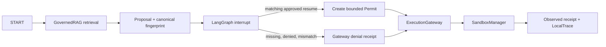

# L1 LangGraph governed execution

## Purpose and boundary

The original `state_graph.py` remains the historical classifier/retrieval
reference graph. `governed_execution.py` adds a separately injectable graph
that demonstrates the material path: governed retrieval, proposed filesystem
write, explicit interrupt/resume approval, `ExecutionRequest`, `Permit`,
`ExecutionGateway`, typed `SandboxRequest`, `SandboxManager`, receipt, and
`LocalTrace`.



The factory binds an existing workspace directory, a `GovernedRAG` instance,
and an `ExecutionGateway`. Request fields are proposal data; the trusted
workspace root is captured by the factory. A filesystem write can proceed only
after the graph resumes with both `approved=true` and the exact SHA-256 over a
canonical serialization of the request, parameters, effect/tool, proposer,
context revision, timestamp, workspace, capability, and write scope. The graph
recomputes that fingerprint from the request before minting a permit.

## What the local approval proves

LangGraph `interrupt()` pauses the graph and requires a checkpointer plus a
thread ID. `Command(resume=...)` resumes that same checkpoint. This demo uses
`InMemorySaver`; it proves the application flow and request binding in one
process. It does not authenticate the person who sent the resume payload, and
the checkpoint is not durable across process restart. Production identity,
durable checkpoint storage, expiry/revocation policy, and authorization audit
remain separate work.

## Execution and evidence

The graph makes a typed `FilesystemRequest`; it does not construct a shell
command. The permit narrows execution to `repository_worker`, the factory-bound
workspace, `filesystem_write`, `write_scope=workspace`, network denied, and a
10-second sandbox policy timeout. The existing `LocalRestrictedBackend`
enforces logical path/workspace controls and emits `SandboxReceipt`. It is not
an OS container and does not claim OS-level or network isolation.

An optional test-running action is disabled by default. A caller must
explicitly register `allow_test_runner=True`; when enabled, the graph accepts
only the sandbox's typed `pytest` capability, a workspace-relative target, and
a timeout no greater than two seconds. Its `test_runner` profile denies
filesystem write capability and network access. The timeout evidence runs an
actual slow pytest case through `ExecutionGateway` and records the sandbox's
`TIMEOUT` receipt; it does not launch an arbitrary shell command.

`LocalTrace` is assembled from the actual graph result and receipt object. The
trace records retrieval citations, proposal fingerprint, approval outcome, and
the real sandbox receipt identifier. Denial, path escape, and manager-lifetime
replay also produce receipts. The replay set is in memory: it rejects reuse
within one `SandboxManager` instance, not across restarts.

## Reproduction

```powershell
python scripts/run_l1_governed_execution_demo.py
python -m pytest tests/test_l1_integrated_graph.py tests/test_l1_governance.py tests/test_sandbox.py -q
```

The demo covers success, mismatched approval denial, exact-permit replay,
workspace escape failure, and a real typed test-process timeout. It writes
machine-readable receipts and a transcript under
`evidence/l1-governed-execution-completion-20261010/`. It uses a temporary
workspace, deterministic local retrieval, and no paid or remote provider. The
transcript is a reproducible demo artifact; it is not a screen recording.

## Historical reference-case mapping

| Reference claim | Current test/evidence boundary |
|---|---|
| Graph cannot execute directly | `test_langgraph_cannot_execute_directly`; integrated graph also pauses before effect |
| Permit replay denied | `test_permit_reuse_denied`; integrated exact permit replay is rejected by the same manager |
| Missing/altered approval denied | `test_integrated_graph_pauses_before_effect_and_requires_exact_approval` |
| Workspace escape denied | `test_integrated_graph_path_escape_returns_denial_receipt` |
| Execution-node timeout returns a controlled receipt | `test_integrated_graph_process_timeout_returns_real_timeout_receipt` |
| Retrieval provenance and validity | `test_document_without_provenance_rejected`, `test_superseded_chunk_filtered_in_retrieval`, integrated current/superseded corpus |
| MCP unregistered capability denied | `test_mcp_tool_unregistered_denied` (L5 adapter boundary; not represented as graph transport integration) |
| Bedrock provider timeout controlled | `test_bedrock_provider_timeout_controlled_failure` (L6 adapter boundary, separate from L1 graph execution) |

The historic seven reference checks remain and the integrated L1 test file adds
direct graph-to-RAG/gateway/sandbox evidence. MCP and Bedrock tests do not imply
the L1 graph invokes those adapters.
