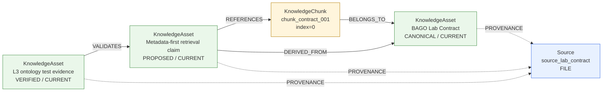

# L3 · Metadata & Ontology Evidence

This artifact is generated by `scripts/generate_l3_ontology_evidence.py` from
the classes in `src/metadata/ontology.py`. It is a deterministic representative
graph for the L3 contract, not a claim that the whole BAGO corpus is indexed.

## Integrity receipt

- Assets: 3
- Chunks: 1
- Relations: 4
- Sources: 1
- `validate_integrity()`: `PASS` (0 errors)
- Claim lineage: `claim_metadata_first → asset_lab_contract`

## Ontology graph

## Scope

The graph demonstrates source provenance, `DERIVED_FROM`, `BELONGS_TO`,
`REFERENCES`, and `VALIDATES`. The full test receipt remains the authoritative
verification for the behavior: `python -m pytest tests/ -q`.
